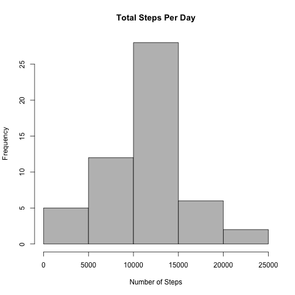
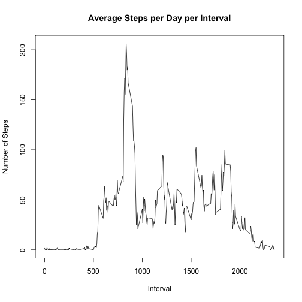
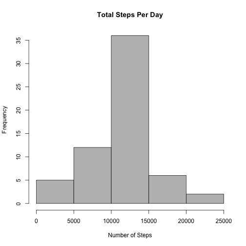
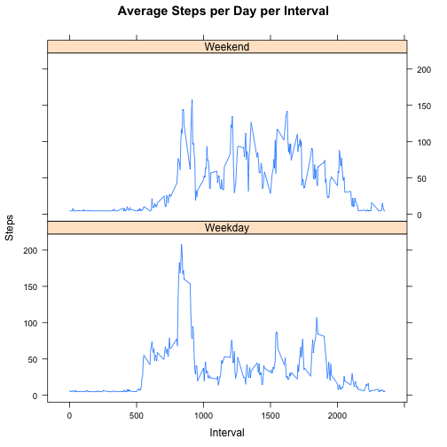

##Introduction##

This assignment makes use of data from a personal activity monitoring device. This device collects data at 5 minute intervals through out the day. The data consists of two months of data from an anonymous individual collected during the months of October and November, 2012 and include the number of steps taken in 5 minute intervals each day.

The data for this assignment can be downloaded from the course web site:

*Dataset:* [Activity monitoring data (52k)](https://d396qusza40orc.cloudfront.net/repdata%2Fdata%2Factivity.zip)

The variables included in this dataset are:

- **steps:** Number of steps taking in a 5-minute interval (missing values are coded as 𝙽𝙰)
- **date:** The date on which the measurement was taken in YYYY-MM-DD format
- **interval:** Identifier for the 5-minute interval in which measurement was taken

The dataset is stored in a comma-separated-value (CSV) file and there are a total of 17,568 observations in this dataset.

##Loading and preprocessing the data##

Below is a summary of the dataset within the relevant working directory:


```r
setwd("~/datasciencecoursera/ReproRsrch/ProjectWk2/")
activity <- read.csv("activity.csv")
summary(activity)
```

```
##      steps                date          interval     
##  Min.   :  0.00   2012-10-01:  288   Min.   :   0.0  
##  1st Qu.:  0.00   2012-10-02:  288   1st Qu.: 588.8  
##  Median :  0.00   2012-10-03:  288   Median :1177.5  
##  Mean   : 37.38   2012-10-04:  288   Mean   :1177.5  
##  3rd Qu.: 12.00   2012-10-05:  288   3rd Qu.:1766.2  
##  Max.   :806.00   2012-10-06:  288   Max.   :2355.0  
##  NA's   :2304     (Other)   :15840
```

##What is the mean total number of steps taken per day?##

*For this part of the assignment, we ignore the missing values in the dataset.*

- Calculate the total number of steps taken per day


```r
steps_per_day <- aggregate(steps ~ date, activity, sum)
head(steps_per_day,n=10)
```

```
##          date steps
## 1  2012-10-02   126
## 2  2012-10-03 11352
## 3  2012-10-04 12116
## 4  2012-10-05 13294
## 5  2012-10-06 15420
## 6  2012-10-07 11015
## 7  2012-10-09 12811
## 8  2012-10-10  9900
## 9  2012-10-11 10304
## 10 2012-10-12 17382
```

- Histogram of the total number of steps taken each day


```r
hist(steps_per_day$steps,col="grey",main=("Total Steps Per Day"),xlab="Number of Steps")
```



- Calculate and report the mean and median of the total number of steps taken per day


```r
mean_steps <- mean(steps_per_day$steps)
median_steps <- median(steps_per_day$steps)
```

The mean is **10766.19** and the median is **10765**

##What is the average daily activity pattern?##

- Time series plot of the 5-minute interval and the average number of steps taken, averaged across all days: 


```r
steps_per_interval <- aggregate(steps ~ interval, activity, mean)
plot(steps_per_interval$interval,steps_per_interval$steps,type="l",main="Average Steps per Day per Interval",xlab="Interval", ylab="Number of Steps")
```



- Which 5-minute interval, on average across all the days in the dataset, contains the maximum number of steps?


```r
max_steps_per_interval <- steps_per_interval[which.max(steps_per_interval$steps),1]
val_max_steps_per_interval <- max(steps_per_interval$steps)
```

The 5-minute interval with the average maximum number of steps is at interval **835** with an average value of **206.17** steps

##Imputing missing values##

Note that there are a number of days/intervals where there are missing values (coded as 𝙽𝙰). The presence of missing days may introduce bias into some calculations or summaries of the data. 

- Calculate and report the total number of missing values in the dataset (i.e. the total number of rows with 𝙽𝙰s)
 

```r
NA_Vals <- sum(is.na(activity$steps))
```

The number of missing values from the dataset is **2304**

- My strategy for filling in all of these missing values in the dataset will be to use the mean number of steps per interval (288 5-minute intervals per day) for the entire dataset


```r
imp_mean_val <- mean_steps/288
```

The imputed value for the missing interval values from the dataset will be **37.3826**
 
- Create a new dataset that is equal to the original dataset but with the missing data filled in.


```r
activity_imputed <- transform(activity, steps = ifelse(is.na(activity$steps), imp_mean_val, activity$steps))
head(activity_imputed,n=10)
```

```
##      steps       date interval
## 1  37.3826 2012-10-01        0
## 2  37.3826 2012-10-01        5
## 3  37.3826 2012-10-01       10
## 4  37.3826 2012-10-01       15
## 5  37.3826 2012-10-01       20
## 6  37.3826 2012-10-01       25
## 7  37.3826 2012-10-01       30
## 8  37.3826 2012-10-01       35
## 9  37.3826 2012-10-01       40
## 10 37.3826 2012-10-01       45
```

- Make a histogram of the total number of steps taken each day


```r
steps_per_day_imputed <- aggregate(steps ~ date, activity_imputed, sum)
hist(steps_per_day_imputed$steps,col="grey",main=("Total Steps Per Day"),xlab="Number of Steps")
```



- Calculate and report the mean and median total number of steps taken per day. Do these values differ from the estimates from the first part of the assignment? 


```r
mean_steps_imputed <- mean(steps_per_day_imputed$steps)
median_steps_imputed <- median(steps_per_day_imputed$steps)
```

The imputed mean is **10766.19** and the imputed median is **10766.19**

- What is the impact of imputing missing data on the estimates of the total daily number of steps?
1. Increase in frequency
2. Mean and median are now equal to original mean

##Are there differences in activity patterns between weekdays and weekends?##

- Create a new factor variable in the dataset with two levels – “weekday” and “weekend” indicating whether a given date is a weekday or weekend day.


```r
weekdays <- c("Monday", "Tuesday", "Wednesday", "Thursday", "Friday")
activity_imputed$days = as.factor(ifelse(is.element(weekdays(as.Date(activity_imputed$date)),weekdays), "Weekday", "Weekend"))
steps_per_interval_imputed <- aggregate(steps ~ interval + days, activity_imputed, mean)
```

- Make a panel plot containing a time series plot (i.e. 𝚝𝚢𝚙𝚎 = "𝚕") of the 5-minute interval (x-axis) and the average number of steps taken, averaged across all weekday days or weekend days (y-axis). 


```r
library(lattice)

xyplot(steps_per_interval_imputed$steps ~ steps_per_interval_imputed$interval|steps_per_interval_imputed$days, main="Average Steps per Day per Interval",xlab="Interval", ylab="Steps",layout=c(1,2), type="l")
```



The plots above indicate an overall higher level of activity (steps) during the weekend than during the weekdays.
