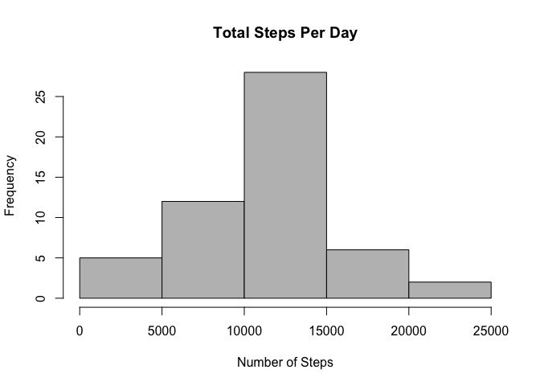

Introduction
------------

This assignment makes use of data from a personal activity monitoring
device. This device collects data at 5 minute intervals through out the
day. The data consists of two months of data from an anonymous
individual collected during the months of October and November, 2012 and
include the number of steps taken in 5 minute intervals each day.

The data for this assignment can be downloaded from the course web site:

*Dataset:* [Activity monitoring data
(52k)](https://d396qusza40orc.cloudfront.net/repdata%2Fdata%2Factivity.zip)

The variables included in this dataset are:

-   **steps:** Number of steps taking in a 5-minute interval (missing
    values are coded as 𝙽𝙰)
-   **date:** The date on which the measurement was taken in YYYY-MM-DD
    format
-   **interval:** Identifier for the 5-minute interval in which
    measurement was taken

The dataset is stored in a comma-separated-value (CSV) file and there
are a total of 17,568 observations in this dataset.

Loading and preprocessing the data
----------------------------------

The following packages/libraries were used in the analysis:

Below is a summary of the dataset within the relevant working directory:

    setwd("~/datasciencecoursera/ReproRsrch/ProjectWk2/")
    activity <- read.csv("activity.csv")
    summary(activity)

    ##      steps                date          interval     
    ##  Min.   :  0.00   2012-10-01:  288   Min.   :   0.0  
    ##  1st Qu.:  0.00   2012-10-02:  288   1st Qu.: 588.8  
    ##  Median :  0.00   2012-10-03:  288   Median :1177.5  
    ##  Mean   : 37.38   2012-10-04:  288   Mean   :1177.5  
    ##  3rd Qu.: 12.00   2012-10-05:  288   3rd Qu.:1766.2  
    ##  Max.   :806.00   2012-10-06:  288   Max.   :2355.0  
    ##  NA's   :2304     (Other)   :15840

What is the mean total number of steps taken per day?
-----------------------------------------------------

*For this part of the assignment, we ignore the missing values in the
dataset.*

-   Calculate the total number of steps taken per day

<!-- -->

    steps_per_day <- aggregate(steps ~ date, activity, sum)
    head(steps_per_day)

    ##         date steps
    ## 1 2012-10-02   126
    ## 2 2012-10-03 11352
    ## 3 2012-10-04 12116
    ## 4 2012-10-05 13294
    ## 5 2012-10-06 15420
    ## 6 2012-10-07 11015

-   Histogram of the total number of steps taken each day

<!-- -->

    hist(steps_per_day$steps,col="grey",main=("Total Steps Per Day"),xlab="Number of Steps")

-   Calculate and report the mean and median of the total number of
    steps taken per day

<!-- -->

    mean_steps <- mean(steps_per_day$steps)
    median_steps <- median(steps_per_day$steps)

The mean is **10766.19** and the median is **10765**

What is the average daily activity pattern?
-------------------------------------------

Imputing missing values
-----------------------

Are there differences in activity patterns between weekdays and weekends?
-------------------------------------------------------------------------
